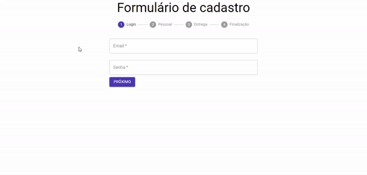

# Form

Project created in one of Alura's React courses to learn about Hooks, Contexts and best practices. <br />

In it: <br />

- I learned about Hooks;
- I used the context API to improve the code;
- I learned about data validation techniques in forms.
  
# Overview



# How to run

```
# Clone this repository
$ git clone https://github.com/velleeda/Form

# Go to the directory
$ cd Form
```
  
```
# Install Dependencies
$ npm install

# Run Web Server
$ npm start
```
